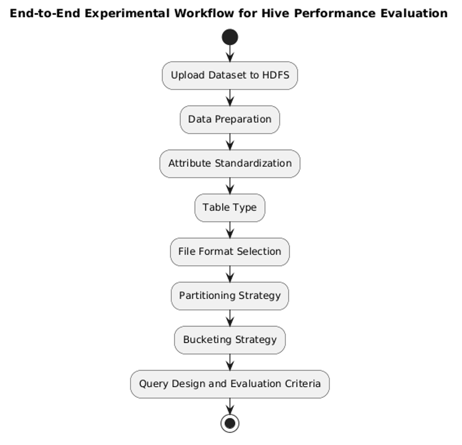
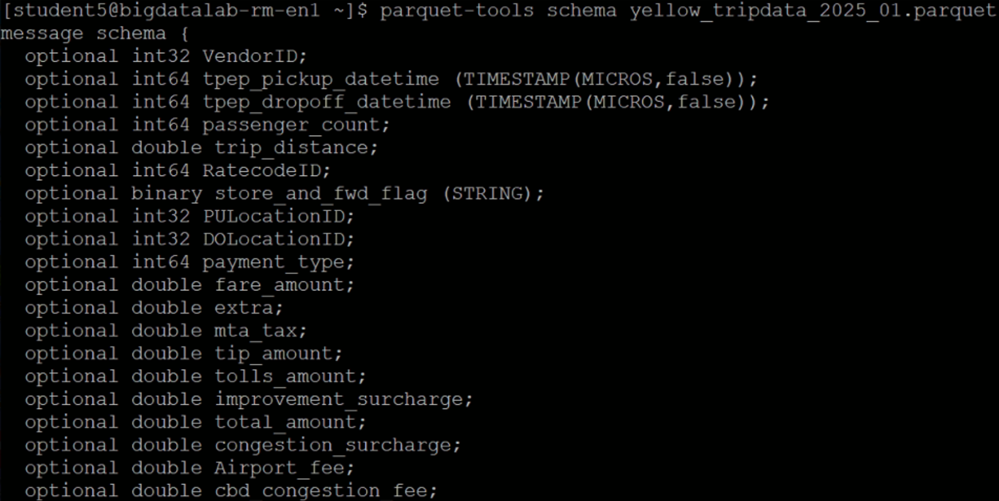
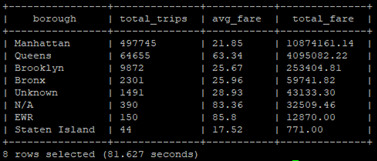
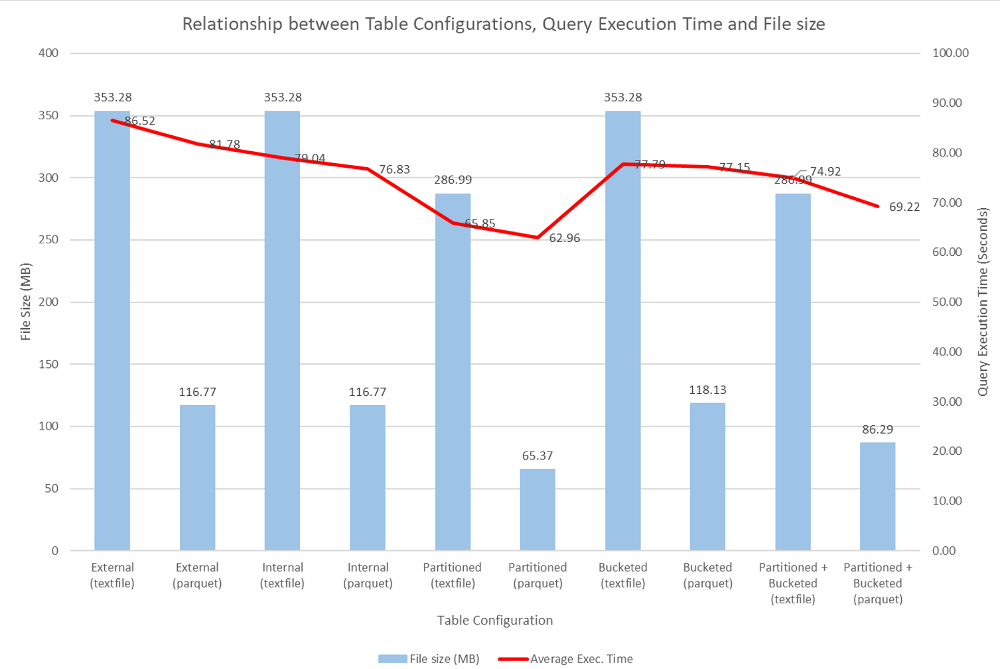

#  NYC Taxi Hive Performance Analysis
<p align="justify">
This project evaluates the performance of different Hive table configurations using the Hadoop ecosystem. The goal is to analyze how storage format, table type, partitioning, and bucketing impact query execution time and storage efficiency by using the NYC Yellow Taxi January 2025 dataset.   
</p>

##  Objective
To analyze how Hive table design affects query performance, comparing:

- External vs Internal tables
- Textfile vs Parquet formats
- Partitioned tables
- Bucketed tables
- Partitioned + Bucketed tables

##  Dataset
- **Primary dataset**: [NYC Taxi Trip Data (Jan 2025)](https://www.nyc.gov/site/tlc/about/tlc-trip-record-data.page#:~:text=January-,Yellow%20Taxi%20Trip%20Records%20(PARQUET),-Green%20Taxi%20Trip)  
- **Size**: ~3.4 million rows
- **Secondary dataset**: [Taxi Zone Lookup Table](https://www.nyc.gov/site/tlc/about/tlc-trip-record-data.page#:~:text=Taxi%20Zone%20Lookup%20Table%20(CSV))  


## Project Workflow
<p align="center">
  
</p>

## Dataset Schema Inspection

Before creating Hive tables, the dataset schema was inspected to understand its structure, data types, and potential compatibility issues.

**Retrieve Dataset from HDFS**

Update the HDFS path based on your environment 

```bash
hdfs dfs -get /user/student5/project_assignment/Dataset/yellow_tripdata_2025_01.parquet
ls
```
This step retrieves the dataset from HDFS to the local environment and verifies that the file has been successfully downloaded.
```bash
parquet-tools schema yellow_tripdata_2025_01.parquet
```
<p align="center">
  
</p>

<p align="justify">
The fields tpep_pickup_datetime and tpep_dropoff_datetime are stored in microsecond precision. The Hive version used does not support microsecond-level timestamps. Therefore, these fields were converted to a compatible format to ensure proper processing in Hive.  
</p>

## Timestamp Conversion (Microseconds → TIMESTAMP)

The original dataset stores `tpep_pickup_datetime` and `tpep_dropoff_datetime` in **microsecond precision**, which is not supported by the Hive version used.

To handle this, a two-step conversion process was applied:

#### Step 1: Store raw timestamps as BIGINT

```sql
CREATE EXTERNAL TABLE nyctaxi_external_rawdataset (
    tpep_pickup_datetime BIGINT,
    tpep_dropoff_datetime BIGINT,
    ...
)
STORED AS PARQUET
LOCATION '{hdfs_dataset_path}';
```
#### Step 2: Convert BIGINT → TIMESTAMP during data insertion
```sql
INSERT INTO nyctaxi_external_parquet
SELECT
    from_unixtime(CAST(tpep_pickup_datetime / 1000000 AS BIGINT)) AS pickup_datetime,
    from_unixtime(CAST(tpep_dropoff_datetime / 1000000 AS BIGINT)) AS dropoff_datetime,
    ...
FROM nyctaxi_external_rawdataset;
```
### SQL Scripts
<p align="justify">
All SQL scripts related to Hive table creation, data transformation, and query execution are available in the 
<a href="./sql/">sql folder</a> of this repository.
</p>

## Example Query (External Textfile)

```sql
SELECT
    z.Borough AS borough,
    COUNT(*) AS total_trips,
    ROUND(AVG(t.total_amount), 2) AS avg_fare,
    CAST(COALESCE(SUM(t.total_amount), 0) AS DECIMAL(15,2)) AS total_fare
FROM nyctaxi_external_textfile t
JOIN nyctaxi_zone z
    ON t.PULocationID = z.LocationID
WHERE to_date(t.pickup_datetime)
      BETWEEN '2025-01-01' AND '2025-01-07'
GROUP BY z.Borough
ORDER BY total_trips DESC;
```

### Query Output (External Textfile)

<p align="center">
  
</p>

**Interpretation:**
- Manhattan records the highest number of trips, indicating the highest taxi demand.
- Queens shows a significantly higher average fare, suggesting longer trip distances.
- Other boroughs have lower trip volumes, with Staten Island being the lowest.

### Performance Comparison (Execution Time vs Storage)

<p align="center">
  
</p>

<p align="justify">
Across every table configuration, Parquet uses much less storage and runs faster than Textfile. For example, in the external table, switching from textfile (353.28 MB, 86.52 s) to Parquet (116.77 MB, 81.78 s) reduces storage by 236.51 MB and improves execution time by 4.74 s. The same trend appears for partitioned tables where partitioned textfile (286.99 MB, 65.85 s) versus partitioned Parquet (65.37 MB, 62.96 s) shows a storage reduction of 221.62 MB and faster execution by 2.89 s.
</p>

## 👤 Author

<p>
  <b>Mohamad Sharul Bin Mohamad Ayub</b><br>
  MSc Data Science, Universiti Teknologi MARA (UiTM)<br>
  🔗 <a href="https://linkedin.com/in/sharulayub">LinkedIn</a>
</p>
